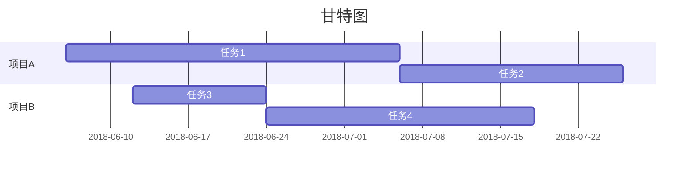
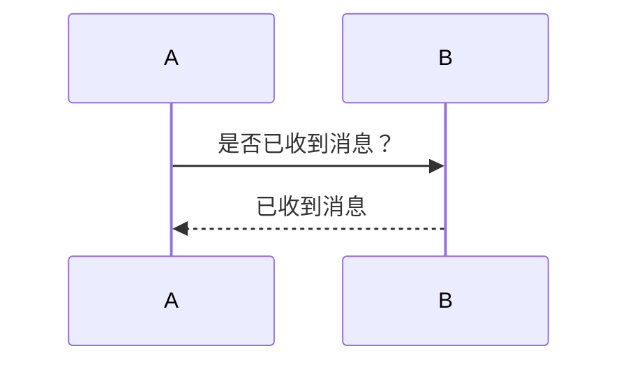
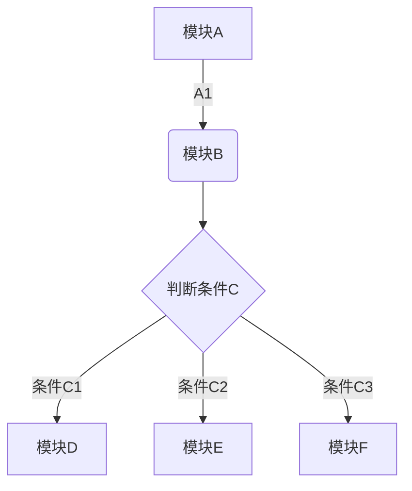

> 读书笔记

# 1 《向死而生》
## 1.1 为何读这本书
## 1.2 触动心灵的语句
  


```mermaid
gantt
title 甘特图
dateFormat  YYYY-MM-DD
section 项目A
任务1           :a1, 2018-06-06, 30d
任务2     :after a1  , 20d
section 项目B
任务3      :2018-06-12  , 12d
任务4      : 24d
```



```mermaid
sequenceDiagram
A->>B: 是否已收到消息？
B-->>A: 已收到消息
```



```mermaid
graph TD
A[模块A] -->|A1| B(模块B)
B --> C{判断条件C}
C -->|条件C1| D[模块D]
C -->|条件C2| E[模块E]
C -->|条件C3| F[模块F]
```

```math
e^{i\pi} + 1 = 0
```